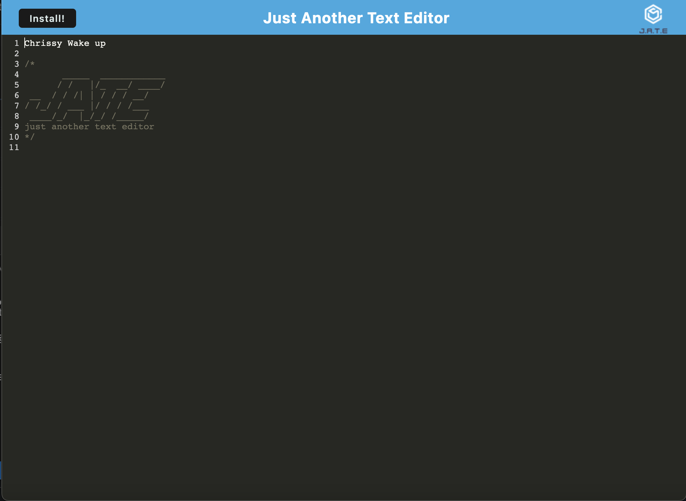

# Just Another Text Editor -J.A.T.E

Link to the Project Repository: [REPO](https://github.com/moyuh/text-editor)

Link to deployed project: [APP](https://j-ate-just-another-text-editor.herokuapp.com/)

## Table of Contents

* [Description](#description)

* [Usage](#usage)

* [License](#license)

* [Questions](#questions)
 
 ## [Description](#table-of-contents)

 User Story
    AS A developer
    I WANT to create notes or code snippets with or without an internet connection
    SO THAT I can reliably retrieve them for later use

 ## [Usage](#table-of-contents)

To store notes or code snippits to be accessed with or without an internet connection.

 ## [License](#table-of-contents) 

This project is under the following license: 

 

 ## [Questions](#table-of-contents)

 To see my other work take a look at my public repositories on github:

 Github: [Github Link](https://github.com/moyuh)

 To contact me directly please reach out to the following email:

 Email: [mlroth94@gmail.com](mailto:mlroth94@gmail.com)